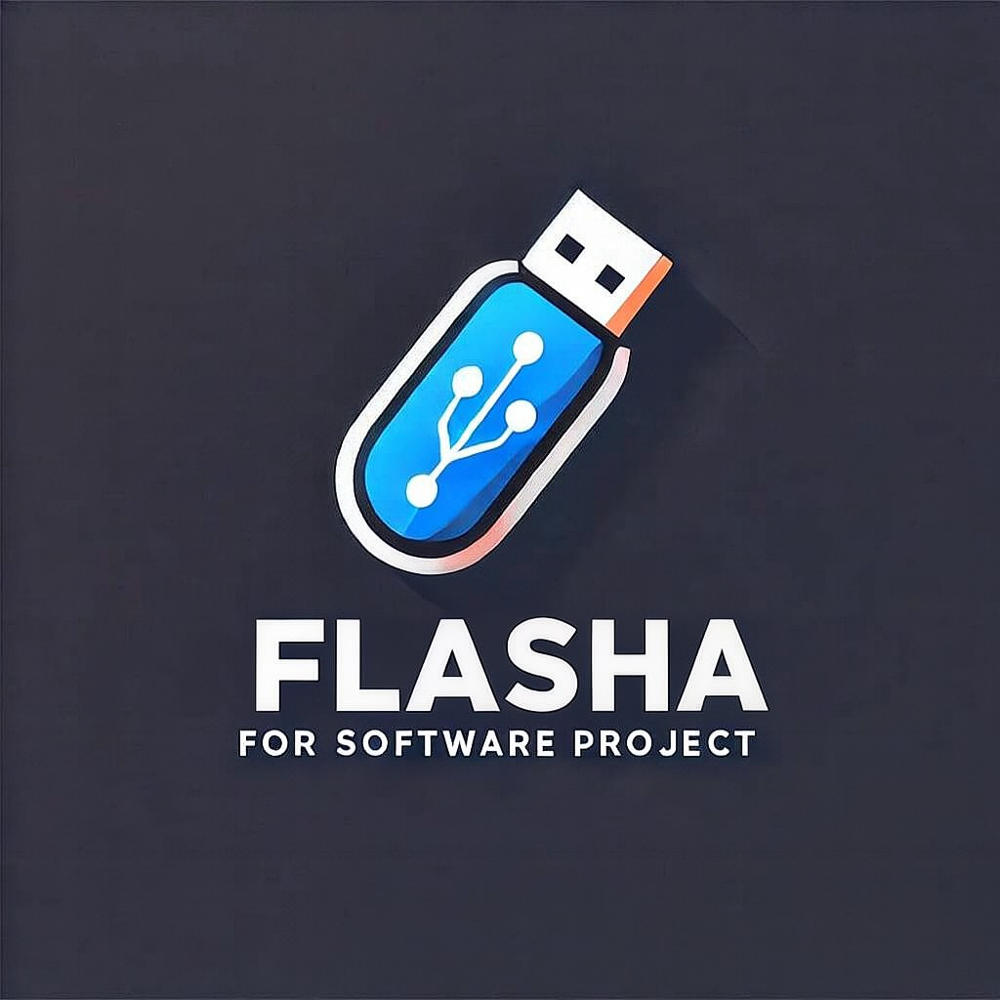

<!-- FLASHA Logo -->

  

<!-- Animated Header -->

 

<!-- Typing Animation -->

  

<!-- Intro Line -->
<h3>
  
  
  
</h3>

  Building backend systems, business platforms, digital products, and practical technical solutions.

 

<!-- Social + Identity -->

  

<!-- Tech Icons -->

  

<!-- Developer Badges -->

  

<!-- Profile Views -->

  

<!-- Divider -->

<!-- MIDDLE SECTION - VIBRANT VERSION -->

 

  

  

<h2>✨ Turning Ideas Into Real Products</h2>

  I build systems, platforms, and digital products that solve real business problems.
  My work combines backend engineering, software architecture, product thinking, and practical AI solutions.

 

   

<h2>🚀 My Core Zones</h2>

<table align="center">
  <tr>
    <td align="center" width="33%">
        
      <strong>Backend Engineering</strong>  
      APIs, business logic, database design, 
      clean architecture, and maintainable systems.
    </td>
    <td align="center" width="33%">
        
      <strong>Platform Building</strong>  
      Admin systems, dashboards, internal tools, 
      and products built for real workflows.
    </td>
    <td align="center" width="33%">
        
      <strong>AI & Training</strong>  
      Practical AI use cases, automation ideas, 
      and technical learning experiences.
    </td>
  </tr>
</table>

  

<h2>🛠️ Currently Focused On</h2>

  

<h2>🌟 Work Style</h2>

  

  I enjoy building software that is clear, useful, scalable, and connected to real goals.

 

